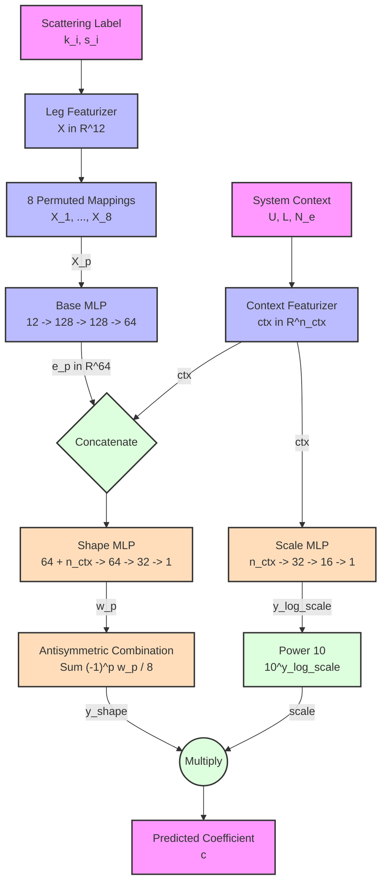

# Two-Stage Antisymmetrized Shape-Scale Neural Network Strategy

This document outlines the mathematical formulation, input featurization, permutation symmetry mappings, and multi-stage network architecture of the neural network strategy (`NeuralNetStrategy`) designed to predict the variational coefficients of coordinate-unitary mappings.

---

## 1. Introduction & Overview

In variational simulations of the Fermi-Hubbard model on a periodic lattice, the variational state is parameterized by a coordinate-unitary transformation $U(\theta) = e^{i A(\theta)}$ applied to a reference state $|\text{ref}\rangle$. The antihermitian operator $A(\theta)$ is expanded over a basis of $n$-body scattering operators:

$$A(\theta) = \sum_j \theta_j \hat{O}_j$$

The neural network strategy provides a highly accurate, generalized map from the physical system context (interaction strength $U$, lattice dimensions $L_x \times L_y$, electron counts $N_\uparrow, N_\downarrow$) and discrete wavevector/spin labels to the predicted initial coefficients $\theta_j$.

---

## 2. Input Featurization

Each scattering label representing a two-body interaction corresponds to four wavevectors $(\mathbf{k}_1, \mathbf{k}_2, \mathbf{k}_3, \mathbf{k}_4)$ and four spin states $(s_1, s_2, s_3, s_4)$.

### A. Leg Featurization
For a $d$-dimensional periodic lattice of dimensions $\mathbf{L} = (L_1, \dots, L_d)$, a discrete site index $\mathbf{n} \in \{1, \dots, L_i\}$ is converted to continuous momentum wavevectors $\mathbf{k} \in [0, 2\pi)^d$ and normalized to the interval $[-1, 1]$:

$$\bar{\mathbf{k}} = \frac{\mathbf{k}}{\pi} - 1.0 \in [-1, 1]^d, \quad \text{where } \mathbf{k} = \frac{2\pi (\mathbf{n} - 1)}{\mathbf{L}}$$

The spin indices $s_i \in \{1, 2\}$ (representing $\uparrow, \downarrow$) are mapped to $\bar{s}_i \in \{-1.0, +1.0\}$:

$$\bar{s} = 2(s - 1) - 1$$

Each individual scattering leg feature vector is a $(d+1)$-dimensional vector:

$$\mathbf{x}_i = \begin{bmatrix} \bar{\mathbf{k}}_i \\ \bar{s}_i \end{bmatrix} \in \mathbb{R}^{d+1}$$

For a 2D lattice ($d=2$), each leg feature $\mathbf{x}_i \in \mathbb{R}^3$. The combined feature vector for a 4-leg scattering event is:

$$\mathbf{X} = [\mathbf{x}_1; \mathbf{x}_2; \mathbf{x}_3; \mathbf{x}_4] \in \mathbb{R}^{12}$$

### B. Context Vector
The physical context is summarized in a context vector $\mathbf{ctx} \in \mathbb{R}^{n_{\text{ctx}}}$. Normalizations are defined as:

*   **Interaction Strength ($U$)**:
    When using the log-scale strategy (`use_scale_head == true`), $U$ is normalized logarithmically in $[-1, 1]$ to prevent compression of small $U$ scales:
    
    $$\bar{U}_{\text{log}} = 2 \times \frac{\log_{10}(U) - \log_{10}(U_{\text{min}})}{\log_{10}(U_{\text{max}}) - \log_{10}(U_{\text{min}})} - 1 \in [-1, 1]$$
    
    where $U_{\text{min}} = 10^{-4}$ and $U_{\text{max}}$ is the maximum interaction strength.
    
    In the unscaled strategy (`use_scale_head == false`), a linear normalization is used instead:
    
    $$\bar{U}_{\text{lin}} = \frac{2U}{U_{\text{max}}} - 1$$

*   **Lattice Dimensions ($L$)**: Normalized as:
    
    $$\bar{\mathbf{L}} = \frac{2\mathbf{L}}{L_{\text{max}}} - 1$$

*   **Electron Counts ($N_e$)**: Normalized relative to half-filling:
    
    $$\bar{N}_e = \frac{2N_e}{N_{\text{max}}} - 1$$

---

## 3. Permutation Symmetries & Antisymmetrization

To enforce the exact physical symmetries of the two-body operator coefficient mapping under particle exchange and Hermiticity, the network output is explicitly antisymmetrized over the 8 valid permutations of the four scattering legs.

Let $\mathbf{X}_p = p(\mathbf{X})$ be the $p$-th permutation of the leg features:

| Permutation ($p$) | Permuted Leg Sequence | Signed Parity ($(-1)^{\sigma_p}$) |
| :--- | :--- | :--- |
| $\mathbf{X}_1$ | $[\mathbf{x}_1; \mathbf{x}_2; \mathbf{x}_3; \mathbf{x}_4]$ | $+1$ |
| $\mathbf{X}_2$ | $[\mathbf{x}_2; \mathbf{x}_1; \mathbf{x}_3; \mathbf{x}_4]$ | $-1$ |
| $\mathbf{X}_3$ | $[\mathbf{x}_1; \mathbf{x}_2; \mathbf{x}_4; \mathbf{x}_3]$ | $-1$ |
| $\mathbf{X}_4$ | $[\mathbf{x}_2; \mathbf{x}_1; \mathbf{x}_4; \mathbf{x}_3]$ | $+1$ |
| $\mathbf{X}_5$ | $[\mathbf{x}_3; \mathbf{x}_4; \mathbf{x}_1; \mathbf{x}_2]$ | $+1$ |
| $\mathbf{X}_6$ | $[\mathbf{x}_4; \mathbf{x}_3; \mathbf{x}_1; \mathbf{x}_2]$ | $-1$ |
| $\mathbf{X}_7$ | $[\mathbf{x}_3; \mathbf{x}_4; \mathbf{x}_2; \mathbf{x}_1]$ | $-1$ |
| $\mathbf{X}_8$ | $[\mathbf{x}_4; \mathbf{x}_3; \mathbf{x}_2; \mathbf{x}_1]$ | $+1$ |

Let $w_p = \text{Shape\_MLP}([\text{Base\_MLP}(\mathbf{X}_p); \mathbf{ctx}])$ be the scalar shape output for permutation $p$. The antisymmetrized shape prediction $y_{\text{shape}}$ is computed as:

$$y_{\text{shape}} = \frac{1}{8} \left( w_1 - w_2 - w_3 + w_4 + w_5 - w_6 - w_7 + w_8 \right)$$

---

## 4. Shape-Scale Network Architecture

The architecture decouples the **functional shape** of the scattering wavevector mapping from the **global physical magnitude scale** of the coefficients.

### A. MLP Layer Dimensions

1.  **Base MLP**: Extracts spatial and spin correlation embeddings.
    $$\mathbf{e}_p = \text{Base\_MLP}(\mathbf{X}_p) \in \mathbb{R}^{64}$$
    *   **Layers**: `Dense(12 => 128, tanh)` $\to$ `Dense(128 => 128, tanh)` $\to$ `Dense(128 => 64)`

2.  **Shape MLP (Context MLP)**: Maps the concatenated embedding and context vector to a shape weight.
    $$w_p = \text{Shape\_MLP}([\mathbf{e}_p; \mathbf{ctx}]) \in \mathbb{R}^1$$
    *   **Layers**: `Dense((64 + n_ctx) => 64, tanh)` $\to$ `Dense(64 => 32, tanh)` $\to$ `Dense(32 => 1)`

3.  **Scale MLP (Scale Head)**: Predicts the global root-mean-square (RMS) scale of the coefficient vector based solely on the system parameters.
    $$y_{\text{log\_scale}} = \text{Scale\_MLP}(\mathbf{ctx}) \in \mathbb{R}^1$$
    *   **Layers**: `Dense(n_ctx => 32, tanh)` $\to$ `Dense(32 => 16, tanh)` $\to$ `Dense(16 => 1)`

---

## 5. Coefficient Reconstruction & Output Modes

### A. Scaled Mode (`use_scale_head == true`)
The final predicted coefficient $c$ is reconstructed by scaling the antisymmetric shape prediction by the base-10 magnitude scale:

$$c = 10^{y_{\text{log\_scale}}} \cdot y_{\text{shape}}$$

During training, the joint objective optimizes both heads simultaneously using:

$$\mathcal{L}_{\text{total}} = \frac{\mathcal{L}_{\text{joint}} + \lambda \mathcal{L}_{\text{aux}}}{1 + \lambda}$$

where $\lambda = 3.0$ is the auxiliary scale weight, and:

$$\mathcal{L}_{\text{joint}} = \text{MSE}\left( 10^{\text{clamp}(y_{\text{log\_scale}} - Y_{\text{log\_scale}}, -3, 3)} \cdot y_{\text{shape}}, Y_{\text{normalized}} \right)$$

$$\mathcal{L}_{\text{aux}} = \text{MSE}\left( y_{\text{log\_scale}}, Y_{\text{log\_scale}} \right)$$

To prioritize small $U$ parameter regimes, sample-dependent importance weights $w = \exp(-0.5 \log_{10} U)$ are applied across the loss functions.

### B. Unscaled Mode (`use_scale_head == false`)
In unscaled mode, the scale head is inactive. The Context MLP maps the concatenated embedding and context directly to the output coefficient:

$$c = y_{\text{shape}}$$

The loss function is a standard mean-squared error (MSE) evaluated directly on the raw coefficient values.
